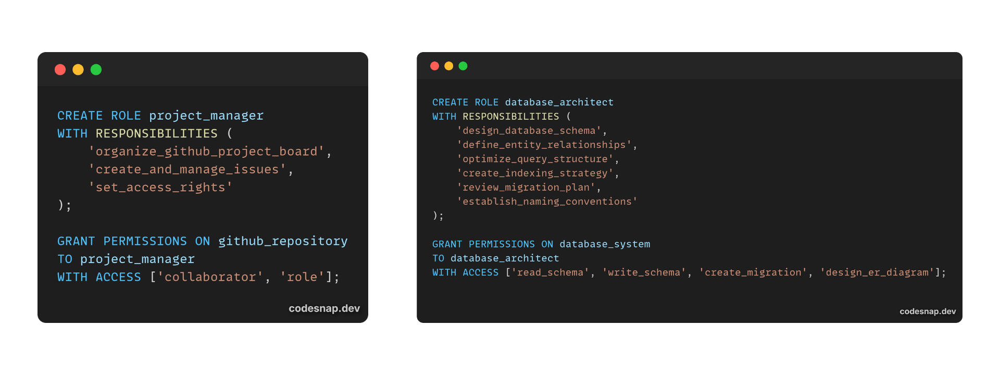

# **WORKSHOP PROJECT WITH PHP INDONESIA** 🖥️
Workshop ini dibuat oleh mahasiswa kelompok 10 Universitas Bina Sarana Informatika Kampus Cikarang Program Studi Sistem Informasi Semester 2.

## 👨‍💻 Kerja Tim

- **Project Manager & Database Architect**    : Ahmad Maulana Zuhdi 19240878 - [Visit my github repository](https://github.com/aldiZuhdi)
- **Database Architect**                      : Defa Raihan Agis 19240506 - [Visit my github repository](https://github.com/...) 
- **Database Architect**                      : Iza Fadwa Shabira 19242232 - [Visit my github repository](https://github.com/...) 
- **Database Architect**                      : Luthfi Nurlaila Zahra 19241663 - [Visit my github repository](https://github.com/...) 
- **Database Architect**                      : Muhammad Galang Nur Falsian 19240646 - [Visit my github repository](https://github.com/...) 
- **Database Architect**                      : Reynanda Gilang Fahnantama 19240647 - [Visit my github repository](https://github.com/...) 
- **Database Architect**                      : Rifdah Rohadatul Aisy 19241045 - [Visit my github repository](https://github.com/...) 
- **Database Architect**                      : Rifki Gustav Ramadhan 19241666 - [Visit my github repository](https://github.com/...) 

## 🔧 Tools yang digunakan
- Github (Repository)
- PopSQL (Query Writting)
- VSCode (File Management)
- XAMPP (MySQL/MariaDB > phpMyAdmin
- Git (command line > github repository)
- DiagramPlus (Build ERD)
- (Build RLS)
